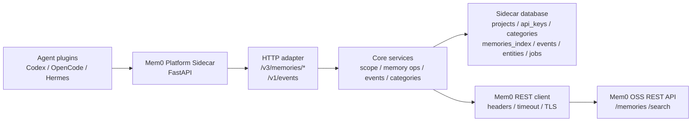

# Mem0 Platform Sidecar

Control-plane sidecar for making self-hosted Mem0 OSS easier to use from
Platform-shaped agent integrations.

The sidecar is not a fork of Mem0. Mem0 OSS remains the memory data plane and
continues to own memory storage, embeddings, and vector search. This service
sits in front of Mem0 OSS and adds the control-plane pieces that agent plugins
often expect: project/app scoping, durable events, memory index projections,
configurable upstream auth, and operational logs.

## Goals

- Keep Mem0 OSS as the source of truth for memory content and search.
- Add a small compatibility layer for clients that expect Mem0 Platform-style
  routes.
- Preserve project/app/user/run isolation for multi-agent and multi-workspace
  usage.
- Stay deployment-neutral: local Docker Compose, an existing Mem0 OSS stack, or
  a gateway-fronted Mem0 deployment should all be configurable by environment.
- Make failures diagnosable through request IDs, structured request logs, and
  upstream call logs.

## Architecture



Request flow:

1. A client calls a Platform-shaped sidecar route.
2. The HTTP adapter resolves `project_id` and `app_id` from the payload, query
   string, or default project configuration.
3. The core service normalizes the request and adds sidecar scope metadata
   before forwarding to Mem0 OSS.
4. Mem0 OSS performs the real add/search/get/delete work.
5. The sidecar stores durable control-plane state such as event records and
   memory index projections.
6. Search results are filtered back through the sidecar index so project/app
   boundaries are preserved.

Important modules:

| Path | Responsibility |
| --- | --- |
| `src/mem0_sidecar/http_adapter/` | FastAPI app, routes, dependencies, project/app resolution |
| `src/mem0_sidecar/core/` | Memory operations, events, categories, scope normalization |
| `src/mem0_sidecar/mem0_client/` | REST client for the Mem0 OSS data plane |
| `src/mem0_sidecar/store/` | SQLAlchemy models, database setup, repositories |
| `src/mem0_sidecar/observability.py` | request ID handling and structured logs |
| `src/mem0_sidecar/workers/` | worker runner skeleton for later async jobs |
| `docker/` | Dockerfile plus sidecar-only and E2E compose files |
| `tests/e2e/` | Live Mem0 OSS E2E harness and OpenAI-compatible test stub |

## Current API Surface

| Method | Path | Purpose |
| --- | --- | --- |
| `GET` | `/healthz` | Liveness check for the sidecar process |
| `GET` | `/readyz` | Readiness check for the sidecar database session |
| `POST` | `/v3/memories/add/` | Add a scoped memory through Mem0 OSS |
| `POST` | `/v3/memories/search/` | Search scoped memories through Mem0 OSS |
| `GET` | `/v1/memories/{memory_id}/` | Read a memory through Mem0 OSS with sidecar scope validation |
| `DELETE` | `/v1/memories/{memory_id}/` | Delete a memory through Mem0 OSS and record a sidecar event |
| `GET` | `/v1/events` | List sidecar events for a project |
| `GET` | `/v1/event/{event_id}` | Read one sidecar event for a project |

This is a compatibility layer, not a complete Mem0 Cloud or Platform clone.
Dashboard, billing, analytics, hosted auth, webhooks, and full project
management APIs are intentionally outside the current implementation.

## Project And App Scope

The sidecar resolves project scope in this order:

1. `project_id` in the JSON payload.
2. `project_id` in the query string.
3. `app_id` in the JSON payload.
4. `app_id` in the query string.
5. `MEM0_SIDECAR_DEFAULT_PROJECT_ID`.

`app_id` is resolved from the JSON payload first, then the query string. When a
memory is added, the sidecar writes internal scope metadata into the upstream
Mem0 OSS request:

- `_mem0_sidecar_project_id`
- `_mem0_sidecar_app_id`

Search requests include the same scope metadata as upstream filters, and the
returned results are checked against the sidecar memory index.

## Quick Start

Install locally:

```bash
python -m venv .venv
. .venv/bin/activate
python -m pip install -e ".[dev]"
```

Run the service against a local Mem0 OSS REST endpoint:

```bash
MEM0_SIDECAR_MEM0_BASE_URL=http://127.0.0.1:8000 \
uvicorn mem0_sidecar.http_adapter.app:create_app \
  --factory \
  --host 127.0.0.1 \
  --port 8765
```

Check health:

```bash
curl http://127.0.0.1:8765/healthz
curl http://127.0.0.1:8765/readyz
```

Add and search:

```bash
curl -sS http://127.0.0.1:8765/v3/memories/add/ \
  -H 'Content-Type: application/json' \
  -H 'X-Request-ID: readme-demo-add' \
  -d '{
    "project_id": "demo-project",
    "app_id": "codex",
    "user_id": "demo-user",
    "messages": [{"role": "user", "content": "The sidecar is deployed with Docker."}]
  }'

curl -sS http://127.0.0.1:8765/v3/memories/search/ \
  -H 'Content-Type: application/json' \
  -H 'X-Request-ID: readme-demo-search' \
  -d '{
    "project_id": "demo-project",
    "app_id": "codex",
    "user_id": "demo-user",
    "query": "Docker deployment"
  }'
```

## Docker Deployment

The repository ships a sidecar-only compose file. It does not start Mem0 OSS
for you, and it does not assume how your Mem0 OSS stack is named. You must set
`MEM0_SIDECAR_MEM0_BASE_URL` to a URL that is reachable from inside the sidecar
container.

```bash
cp .env.example .env
# Edit MEM0_SIDECAR_MEM0_BASE_URL for your Docker network or gateway.
docker compose -f docker/docker-compose.dev.yml up --build -d
curl http://127.0.0.1:8765/healthz
```

Common `MEM0_SIDECAR_MEM0_BASE_URL` values:

| Deployment shape | Example value |
| --- | --- |
| Same compose network | `http://mem0:8000` |
| External Docker network alias | `http://mem0-api:8000` |
| Gateway with path prefix | `https://gateway.example/mem0` |
| Host service on Docker Desktop | `http://host.docker.internal:8000` |

On Linux, `host.docker.internal` may require an explicit compose
`extra_hosts` entry. Prefer a Docker network alias when possible.

## Dashboard Overlay

The sidecar includes an optional Mem0 OSS dashboard overlay that unlocks the
self-hosted Categories and Export pages. Phase 1 is intentionally narrow:
Categories and Export are self-hosted, while the rest of the Cloud-only
dashboard remains unchanged and unimplemented in the overlay. The overlay source
lives under `integrations/mem0-dashboard-overlay/` and is applied to an
upstream `server/dashboard` checkout.

```bash
python integrations/mem0-dashboard-overlay/scripts/apply-dashboard-overlay \
  /path/to/mem0/server/dashboard
python integrations/mem0-dashboard-overlay/scripts/verify-dashboard-overlay \
  /path/to/mem0/server/dashboard
```

The overlay uses a same-origin Next.js proxy route at `/api/sidecar/...`.
Configure the dashboard runtime with:

```bash
SIDECAR_INTERNAL_API_URL=http://mem0-platform-sidecar:8765
SIDECAR_PROJECT_ID=default
# Only mirror this when the Mem0 OSS server itself runs auth-disabled for local dev.
AUTH_DISABLED=false
```

Set `SIDECAR_PROJECT_ID` in the dashboard runtime to the sidecar project that
should own dashboard category and export actions. If it is not set, the overlay
falls back to `MEM0_SIDECAR_DEFAULT_PROJECT_ID`, then `default`. The project id
is resolved through a server-side dashboard route at runtime, so it is not baked
into the browser bundle.

The proxy validates the dashboard refresh-token cookie before forwarding
sidecar requests. For local development stacks that intentionally run the Mem0
OSS server with `AUTH_DISABLED=true`, set the same value in the dashboard
runtime so the overlay follows that auth-disabled mode. Do not use auth-disabled
dashboard proxying for production deployments.

If verification fails or an upstream dashboard upgrade goes sideways, back out
the overlay in the dashboard checkout before trying again:

1. Run `git status` in the dashboard checkout and review the overlay-applied
   files.
2. Revert only the overlay changes with that checkout's VCS tools, or discard
   and recreate the checkout from a clean copy if you applied the overlay to a
   temporary tree.
3. Do not use `git reset --hard` unless you have already backed up the checkout
   and understand the local changes you are discarding.
4. If the dashboard was already deployed, rebuild and restart it after the
   rollback so the reverted files are the ones in service.

Task-only notes under `docs/superpowers/` remain ignored and internal; keep
them out of published docs and stack configuration.

## Add To An Existing Mem0 OSS Compose Stack

When Mem0 OSS already runs in a compose stack, add the sidecar on the same
network and point `MEM0_SIDECAR_MEM0_BASE_URL` at the Mem0 service name.

```yaml
services:
  mem0-platform-sidecar:
    build:
      context: /path/to/mem0-platform-sidecar
      dockerfile: docker/Dockerfile
    environment:
      MEM0_SIDECAR_DATABASE_URL: sqlite:////data/mem0_sidecar.sqlite3
      MEM0_SIDECAR_MEM0_BASE_URL: http://mem0:8000
      MEM0_SIDECAR_MEM0_API_KEY: ${MEM0_SIDECAR_MEM0_API_KEY:-}
      MEM0_SIDECAR_MEM0_API_KEY_HEADER_NAME: ${MEM0_SIDECAR_MEM0_API_KEY_HEADER_NAME:-X-API-Key}
      MEM0_SIDECAR_MEM0_API_KEY_PREFIX: ${MEM0_SIDECAR_MEM0_API_KEY_PREFIX:-}
      MEM0_SIDECAR_MEM0_EXTRA_HEADERS: ${MEM0_SIDECAR_MEM0_EXTRA_HEADERS:-{}}
      MEM0_SIDECAR_LOG_FORMAT: json
      MEM0_SIDECAR_REQUEST_ID_HEADER: X-Request-ID
    volumes:
      - mem0-sidecar-data:/data
    ports:
      - "8765:8765"
    depends_on:
      - mem0

volumes:
  mem0-sidecar-data:
```

If Mem0 OSS is behind a gateway, set the sidecar base URL to the gateway URL
and configure the auth/header variables below. The sidecar forwards only to the
configured REST base URL and does not make assumptions about where Mem0 OSS is
deployed.

## Configuration

All settings are read from environment variables with the `MEM0_SIDECAR_`
prefix. `.env.example` is the deployment starting point.

| Variable | Default | Notes |
| --- | --- | --- |
| `MEM0_SIDECAR_DATABASE_URL` | `sqlite:///./mem0_sidecar.sqlite3` | Sidecar control-plane database. The Docker example uses `sqlite:////data/mem0_sidecar.sqlite3` with a persistent volume. |
| `MEM0_SIDECAR_MEM0_BASE_URL` | `http://127.0.0.1:8000` | Mem0 OSS REST base URL as seen from the sidecar runtime. Required for real Docker deployments. |
| `MEM0_SIDECAR_MEM0_API_KEY` | empty | Optional static upstream API key. |
| `MEM0_SIDECAR_MEM0_API_KEY_HEADER_NAME` | `X-API-Key` | Header name used for the upstream API key. |
| `MEM0_SIDECAR_MEM0_API_KEY_PREFIX` | empty | Optional prefix, for example `Bearer` when using `Authorization`. |
| `MEM0_SIDECAR_MEM0_EXTRA_HEADERS` | `{}` | JSON object of static headers sent to Mem0 OSS or a gateway. |
| `MEM0_SIDECAR_MEM0_MEMORIES_PATH` | `/memories` | Upstream add/get/delete path. |
| `MEM0_SIDECAR_MEM0_SEARCH_PATH` | `/search` | Upstream search path. |
| `MEM0_SIDECAR_MEM0_REQUEST_TIMEOUT_SECONDS` | `30` | Upstream request timeout. |
| `MEM0_SIDECAR_MEM0_CONNECT_TIMEOUT_SECONDS` | unset | Upstream connect timeout. `.env.example` sets `30` for Docker. |
| `MEM0_SIDECAR_MEM0_VERIFY_TLS` | `true` | Verify TLS certificates for HTTPS upstreams. |
| `MEM0_SIDECAR_MEM0_CA_BUNDLE` | unset | Optional CA bundle path for private CAs. |
| `MEM0_SIDECAR_DEFAULT_PROJECT_ID` | `default` | Fallback project when neither `project_id` nor `app_id` is provided. |
| `MEM0_SIDECAR_WORKER_POLL_INTERVAL_SECONDS` | `1` | Reserved for the worker runner. |
| `MEM0_SIDECAR_LOG_LEVEL` | `INFO` | Python logging level. |
| `MEM0_SIDECAR_LOG_FORMAT` | `text` | Use `json` for container logs. |
| `MEM0_SIDECAR_REQUEST_ID_HEADER` | `X-Request-ID` | Header propagated into request and upstream logs. |

Auth examples:

```bash
# Default X-API-Key style.
MEM0_SIDECAR_MEM0_API_KEY=secret
MEM0_SIDECAR_MEM0_API_KEY_HEADER_NAME=X-API-Key

# Gateway style Authorization header.
MEM0_SIDECAR_MEM0_API_KEY=secret
MEM0_SIDECAR_MEM0_API_KEY_HEADER_NAME=Authorization
MEM0_SIDECAR_MEM0_API_KEY_PREFIX=Bearer

# Static gateway headers.
MEM0_SIDECAR_MEM0_EXTRA_HEADERS='{"X-Mem0-Org":"org-1"}'
```

## Observability

- `/healthz` checks that the sidecar process is alive.
- `/readyz` checks that the sidecar database can execute a simple query.
- Every request receives or propagates the configured request ID header.
- Set `MEM0_SIDECAR_LOG_FORMAT=json` for structured request logs in Docker.
- Upstream Mem0 OSS calls emit structured success/failure logs with method,
  path, status code, latency, and request ID.

`/readyz` does not prove that Mem0 OSS can add/search/delete memories. Use the
live E2E harness below for that.

## Verification

Run the normal regression suite:

```bash
PYTHONDONTWRITEBYTECODE=1 python -m pytest -q -p no:cacheprovider
```

Run the live E2E harness:

```bash
PYTHONDONTWRITEBYTECODE=1 python scripts/run_live_e2e_compose.py
```

The live harness starts a temporary local compose stack with Mem0 OSS,
Postgres/pgvector, and an OpenAI-compatible stub, runs the sidecar against the
Mem0 service inside that compose network, verifies add/search/read/delete plus
durable add/delete events, and then removes the containers and volumes.

For manual debugging against an already running compatible backend:

```bash
MEM0_E2E_BASE_URL=http://127.0.0.1:8000 \
MEM0_E2E_PROJECT_ID=sidecar-e2e \
PYTHONDONTWRITEBYTECODE=1 python -m pytest tests/e2e/test_live_mem0_oss.py -v -rs -p no:cacheprovider
```

If `MEM0_E2E_BASE_URL` is not set, the direct live pytest path skips instead
of failing. A skipped live E2E test is not a live pass.

## More Documentation

- [Development](docs/development.md)
- [E2E Testing](docs/e2e.md)
- [Design](docs/design.md)
