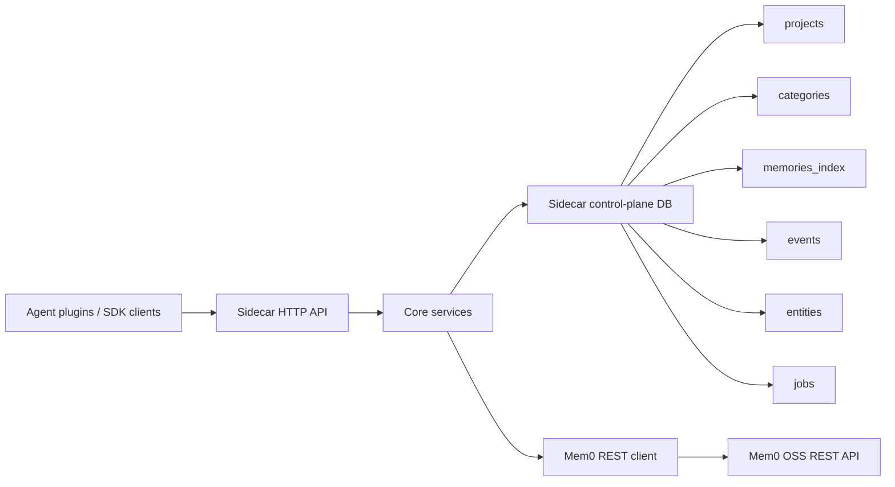

# Mem0 Platform Sidecar Design

Date: 2026-07-04
Status: Public design baseline

## Overview

Mem0 Platform Sidecar is a standalone control-plane service for self-hosted
Mem0 OSS deployments. It provides Platform-shaped compatibility behavior for
agent integrations while keeping Mem0 OSS as the memory data plane.

The sidecar does not replace Mem0 OSS. Mem0 OSS continues to own memory
extraction, embedding, vector storage, search, and the source of truth for
memory content. The sidecar owns control-plane state and compatibility
semantics that are useful for official Mem0 integrations and coding-agent
plugins.

## Core Decision

Build `mem0-platform-sidecar` as a standalone service.

The sidecar is not:

- a Mem0 OSS fork;
- a replacement vector search or extraction engine;
- a `mem0-oss-mcp` v2 extraction;
- a full self-hosted Mem0 Cloud clone;
- a dashboard, analytics, billing, or organization-management product.

The compatibility contract is Mem0 OSS REST. The sidecar should avoid direct
writes to Mem0 OSS internal database tables so deployments remain easier to
upgrade.

## Goals

1. Provide a durable control plane for Mem0 OSS.
2. Expose Platform-shaped HTTP behavior for integration paths that expect it.
3. Preserve `project_id`, `app_id`, `user_id`, `agent_id`, and `run_id` scope.
4. Keep official plugin overlays thin and upgrade-safe.
5. Make deployment generic enough for local Compose, existing Mem0 OSS stacks,
   or gateway-fronted Mem0 OSS.
6. Make failures diagnosable with request IDs, structured request logs, and
   upstream Mem0 OSS call logs.
7. Validate behavior with unit, integration, and live local-compose E2E tests.

## Non-Goals

The current project does not implement:

- hosted Mem0 Cloud auth or billing;
- dashboard and analytics UI;
- organization, team, or permission management;
- webhook UI;
- replacement vector search;
- replacement memory extraction;
- direct upstream Mem0 OSS patches;
- complete parity with every hosted Mem0 Platform product surface.

## Architecture



Request flow:

1. A client calls a Platform-shaped sidecar endpoint.
2. The HTTP adapter resolves project and app scope from payload, query params,
   or defaults.
3. Core services normalize the request and add sidecar scope metadata.
4. The Mem0 client forwards the data-plane operation to Mem0 OSS REST.
5. The sidecar records durable control-plane state such as events and memory
   index projections.
6. Searches are filtered through the sidecar index to preserve project/app
   boundaries.

## Module Boundaries

| Module | Responsibility |
| --- | --- |
| `http_adapter` | FastAPI app, HTTP routes, request dependencies, project/app scope resolution |
| `core` | Memory operations, scope normalization, category extraction, events |
| `mem0_client` | The only module that calls Mem0 OSS REST |
| `store` | SQLAlchemy models, database setup, repositories |
| `observability` | request ID handling, request logs, upstream call logs |
| `workers` | worker runner skeleton for future async jobs |

HTTP route functions should stay thin. Core services should remain usable from
future MCP handlers or worker jobs without calling HTTP adapters.

## Control-Plane Data

The sidecar stores projections and metadata that Mem0 OSS does not expose as a
Platform-like control plane.

| Table | Purpose |
| --- | --- |
| `projects` | project/app defaults and upstream Mem0 OSS target metadata |
| `api_keys` | future mapping of external credentials to projects |
| `categories` | project-level custom category configuration |
| `memories_index` | scoped projection of Mem0 OSS memory IDs and metadata |
| `events` | durable external operation log for mutating operations |
| `entities` | future derived entity index for users, agents, apps, runs, and custom entities |
| `jobs` | future internal background work queue |

The memory text remains owned by Mem0 OSS. `memories_index` exists to support
scoping, filtering, category projection, management workflows, and future
export/import behavior.

## Scope Semantics

Project scope is resolved in this order:

1. `project_id` in the JSON payload.
2. `project_id` in the query string.
3. `app_id` in the JSON payload.
4. `app_id` in the query string.
5. `MEM0_SIDECAR_DEFAULT_PROJECT_ID`.

`app_id` is resolved independently from payload first, then query string.

When adding memories, the sidecar forwards internal scope metadata to Mem0 OSS:

- `_mem0_sidecar_project_id`
- `_mem0_sidecar_app_id`

When searching, the same metadata is included as upstream filters. Returned
results are checked against the sidecar memory index before being returned to
the client. This keeps different projects and apps from collapsing into one
shared namespace.

## Current HTTP Surface

| Method | Path | Status |
| --- | --- | --- |
| `GET` | `/healthz` | implemented |
| `GET` | `/readyz` | implemented |
| `POST` | `/v3/memories/add/` | implemented |
| `POST` | `/v3/memories/search/` | implemented |
| `GET` | `/v1/memories/{memory_id}/` | implemented |
| `DELETE` | `/v1/memories/{memory_id}/` | implemented |
| `GET` | `/v1/events` | implemented |
| `GET` | `/v1/event/{event_id}` | implemented |

Planned compatibility areas include broader `/v3/memories/*` coverage,
project/category configuration endpoints, entity tools, and MCP-compatible
handlers.

## Deployment Model

The sidecar is configured entirely by environment variables. The most important
setting is `MEM0_SIDECAR_MEM0_BASE_URL`, which must be the Mem0 OSS REST base
URL as seen from the sidecar runtime.

Supported deployment shapes:

- local Python process pointing at a local Mem0 OSS endpoint;
- sidecar-only Docker Compose with an external Mem0 OSS base URL;
- sidecar service added to an existing Mem0 OSS Compose stack;
- gateway-fronted Mem0 OSS with configurable auth headers, extra headers, TLS,
  and timeout settings.

The default sidecar database is SQLite. The Docker examples persist it on a
volume at `/data/mem0_sidecar.sqlite3`.

## Observability

The service emits:

- liveness via `/healthz`;
- database readiness via `/readyz`;
- request logs with request method, path, status, latency, and request ID;
- upstream Mem0 OSS logs with method, path, status, latency, and request ID.

`/readyz` proves that the sidecar database can execute a simple query. It does
not prove that Mem0 OSS can perform add/search/delete operations. Use the live
compose E2E harness for real data-plane validation.

## Verification Strategy

Use three levels of verification:

1. Unit tests for scope, repositories, core services, config, and client
   behavior.
2. In-process HTTP/integration tests using fake upstream clients and SQLite.
3. Live E2E through `scripts/run_live_e2e_compose.py`, which starts a temporary
   Mem0 OSS stack, Postgres/pgvector, and an OpenAI-compatible stub, then
   verifies add/search/read/delete and durable sidecar events.

Standard checks:

```bash
python -m ruff check .
PYTHONDONTWRITEBYTECODE=1 python -m pytest -q -p no:cacheprovider
PYTHONDONTWRITEBYTECODE=1 python scripts/run_live_e2e_compose.py
```

## Roadmap

### Phase 0: Bootstrap

- repository skeleton;
- configuration;
- local development docs;
- Dockerfile and compose baseline;
- lint/test conventions.

### Phase 1: Control Plane Core

- project, category, memory index, event, entity, and job models;
- repositories;
- scope normalization;
- durable events for mutating memory operations;
- Mem0 REST client boundary;
- worker runner skeleton.

### Phase 2: HTTP Platform Compatibility

- broader `/v3/memories/*` support;
- project/custom category configuration endpoints;
- response-shape contract tests.

### Phase 3: MCP Compatibility

- hosted-MCP-like tools;
- MCP handlers backed by core services;
- entity and event tool behavior;
- contract tests for tool inputs and outputs.

### Phase 4: Official Integration Validation

- repeatable Codex smoke test;
- repeatable OpenCode smoke test;
- Hermes direct-OSS and sidecar notes;
- documented integration examples.

### Phase 5: Operational Features

- export and import jobs;
- category backfill;
- entity rebuild;
- job retry and cancellation;
- basic webhook registration and delivery attempts.

## Design Constraints

- Keep Mem0 OSS as the data plane.
- Keep sidecar control-plane state explicit and durable.
- Preserve project/app isolation.
- Make destructive operations scope-explicit and evented.
- Keep compatibility shims close to adapters, not scattered through storage.
- Prefer configuration over deployment assumptions.
- Add live E2E coverage for behavior that depends on Mem0 OSS.
